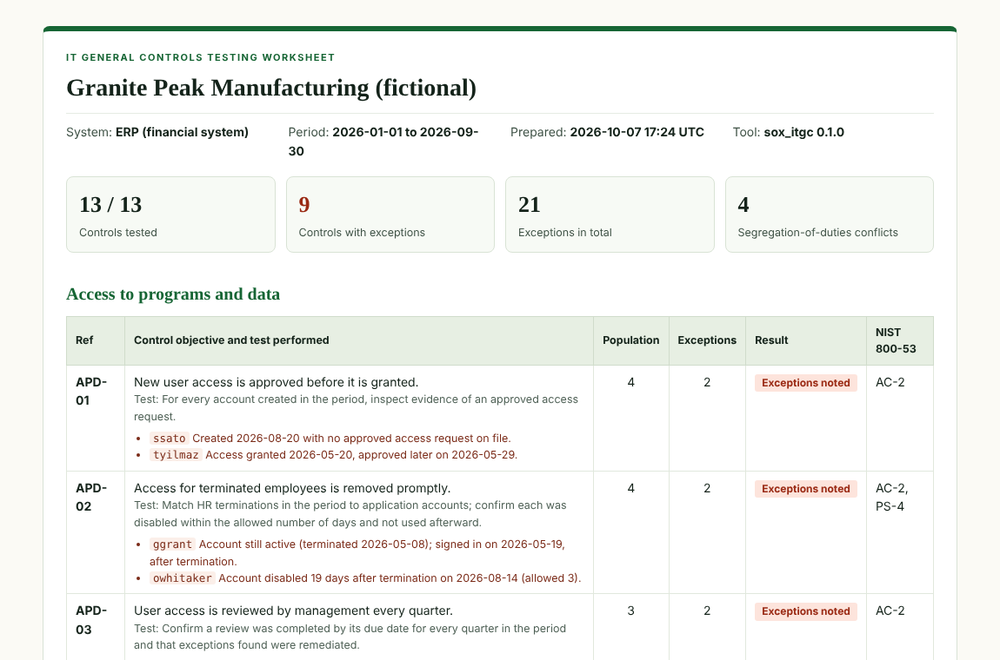

# SOX ITGC Audit Framework

[](https://github.com/Edward-Owusu/sox-itgc-audit-framework/actions/workflows/tests.yml)
[](LICENSE)
[](https://doi.org/10.5281/zenodo.23220075)
[](https://sox-itgc-audit-framework.streamlit.app)

An open-source tool for testing the **IT general controls (ITGCs)** behind a company's financial reporting. It reads standard exports from a financial system (user listings, role assignments, HR terminations, change logs, and job histories), tests **13 controls** across access, change management, and operations against the **full population**, builds a **segregation-of-duties conflict matrix**, and produces an auditor-style **testing worksheet**.

It is built for **smaller public companies, pre-IPO businesses, and the internal and external auditors who test them**.



## Why this matters

The Sarbanes-Oxley Act requires public companies to maintain and assess internal control over financial reporting. Every automated calculation, interface, and report in a financial system depends on the IT general controls around it: who can access the system, how changes reach production, and whether data can be recovered. When those controls fail, auditors cannot rely on the system, and the company may have to report a control deficiency or material weakness.

Large companies use governance, risk, and compliance (GRC) platforms and dedicated IT audit teams to test these controls. Smaller public companies and businesses preparing to go public often rely on spreadsheets and manual sampling, which is slow, error-prone, and examines only a handful of items. Common problems, such as a departed employee whose account was never disabled, a developer pushing their own code to production, or a clerk who can both create vendors and approve payments, slip through.

This tool tests every item in the population in seconds and documents the results in a format auditors recognize. It helps smaller companies find and fix ITGC gaps before their auditors do, lowers the cost of compliance, and supports the reliable financial reporting investors depend on.

## What it does

- Tests **13 ITGCs** in three domains:
  - **Access to programs and data:** new access approvals, removal of leavers (including accounts used after termination), quarterly access reviews and remediation, privileged access, segregation of duties, and generic accounts
  - **Program change:** approval before deployment, testing, developers deploying their own changes, independent approval, and emergency changes
  - **Computer operations:** follow-up of failed backup and batch jobs, and restore testing
- Tests the **entire population**, not a sample, and lists every exception with the reason.
- Builds a **segregation-of-duties matrix** from an adjustable rule set of incompatible roles, with the business risk each conflict creates.
- Produces an **auditor's worksheet** with control objective, test performed, population, exceptions, result, and sign-off lines.
- Cross-references each control to **NIST SP 800-53 Rev. 5**.
- Leaves deficiency classification to the auditor, as professional standards require.
- Produces reports in **HTML, Markdown, CSV (one row per exception), and JSON**, with a command-line tool and an interactive **Streamlit dashboard**.
- Has **no third-party dependencies** in its core engine.

## Quick start

Requires Python 3.10 or later.

```bash
git clone https://github.com/Edward-Owusu/sox-itgc-audit-framework.git
cd sox-itgc-audit-framework
pip install -e .

sox-itgc samples/granite_peak --format html md csv
```

Example output:

```
Granite Peak Manufacturing (fictional) | ERP (financial system) | 2026-01-01 to 2026-09-30
Controls tested: 13/13 | with exceptions: 9 | exceptions: 21 | SoD conflicts: 4
  APD-01  Exceptions noted   2 of 4   New user access is approved before it is granted.
  APD-02  Exceptions noted   2 of 4   Access for terminated employees is removed promptly.
  APD-03  Exceptions noted   2 of 3   User access is reviewed by management every quarter.
  ...
  PC-03   Exceptions noted   3 of 26  Developers cannot deploy their own changes to production.
  ...
```

Open the HTML file in the `reports` folder for the worksheet and matrix. Pre-generated worksheets are in [docs/example-reports](docs/example-reports).

### Dashboard

```bash
pip install -r requirements.txt
streamlit run app/streamlit_app.py
```

Try the hosted version with sample data at https://sox-itgc-audit-framework.streamlit.app, or run it locally:

### Use in automation

`--fail-on-deficiency` exits with code 2 when any control has exceptions, so the tests can run monthly as a continuous control monitoring check:

```bash
sox-itgc engagement_folder --fail-on-deficiency
```

## Testing your own system

1. Copy `samples/template/` to a new folder.
2. Export the seven files from your financial system, HR system, ticketing system, and backup tool, as described in the [input reference](docs/data-reference.md), and set the audit period in `settings.json`.
3. Rename the roles in `src/sox_itgc/data/sod_rules.json` to match your application.
4. Run the tool, investigate each exception, and record your conclusions.

## Related projects

Part of a series of open-source GRC tools for small and mid-sized organizations:

- [NIST SP 800-53 Assessment Tool](https://github.com/Edward-Owusu/Nist-800-53-assessment-tool)
- [Zero Trust IAM Auditor](https://github.com/Edward-Owusu/Zero-trust-iam-auditor)
- [MFA Compliance Tracker](https://github.com/Edward-Owusu/mfa-compliance-tracker)
- [FedRAMP Cloud Analyzer](https://github.com/Edward-Owusu/fedramp-cloud-analyzer)
- [CMMC Readiness Toolkit](https://github.com/Edward-Owusu/cmmc-readiness-toolkit)
- [Vendor Risk Dashboard](https://github.com/Edward-Owusu/vendor-risk-dashboard)
- [Ransomware Resilience Framework](https://github.com/Edward-Owusu/ransomware-resilience-framework)
- [HIPAA Audit Engine](https://github.com/Edward-Owusu/hipaa-audit-engine)

## Data and limitations

All sample data is synthetic and does not describe any real organization or person. The tool tests the data supplied; auditors should confirm that populations are complete and accurate. Exceptions are observations, not conclusions: classifying deficiencies requires professional judgment, and the tool does not express an opinion on internal control over financial reporting. See the [methodology](docs/methodology.md).

## References

- Sarbanes-Oxley Act of 2002, Sections 302 and 404
- PCAOB Auditing Standard AS 2201, *An Audit of Internal Control Over Financial Reporting That Is Integrated with An Audit of Financial Statements*
- COSO, *Internal Control – Integrated Framework* (2013), Principle 11
- NIST SP 800-53 Rev. 5, *Security and Privacy Controls for Information Systems and Organizations*: https://csrc.nist.gov/pubs/sp/800/53/r5/upd1/final

## Author

**Edward Owusu, CISA**, GRC Analyst and IT Auditor.

Feedback, issues, and contributions are welcome. If you use this tool in an audit or compliance program, I would be glad to hear how it worked for you; please open an issue or get in touch.

## Citation

If you use this tool in research or professional work, please cite it using the metadata in [CITATION.cff](CITATION.cff).

## License

[MIT](LICENSE)
